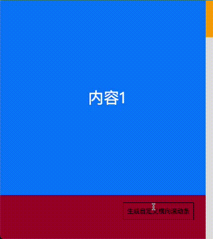

# custom-scrollbar

自定义滚动条



## 安装方式

全局引入 `./customScrollBar.js`

## 使用方法

container、content 为必传参数

```js
new QBScrollBar({
  container, // 父元素（可以理解为定义的可视区域）
  content, // 内部滚动元素（可视区域中的滚动元素）
});
```

### 目前所支持配置

```js
options.pos || 'right' // 滚动条位置（默认值: 'right'） left | top | right | bottom
options.bgColor || '#e1e1e1'; // 滚动条背景色
options.fgColor || '#c7c7c7'; // 滚动块背景色
options.zIndex || 99999; // 滚动条层级
options.width || 10; // 滚动条宽度（竖向滚动条生效: left | right）
options.height || 10; // 滚动条高度（横向滚动条生效: top | bottom）
options.mode || 'absolute'; // 滚动条定位（absolute | fixed）
options.container; // 父元素（可以理解为定义的可视区域）
options.content; // 内部滚动元素（可视区域中的滚动元素）
options.absContainer || options.container; // 滚动条相对目标元素定位
options.className || 'qb-scroll-bar'; // 滚动条类名
options.left || 0; // 定位后设置的 left | top | right | bottom
options.top || 0;
options.right || 0;
options.bottom || 0;
options.hideOriScrollBar || true; // 是否隐藏默认滚动条
```
